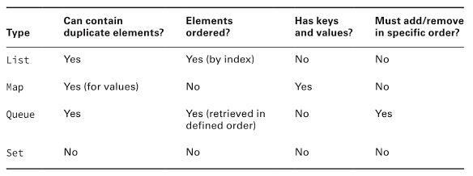
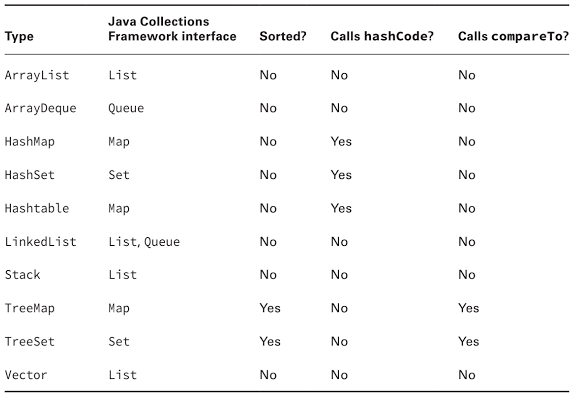
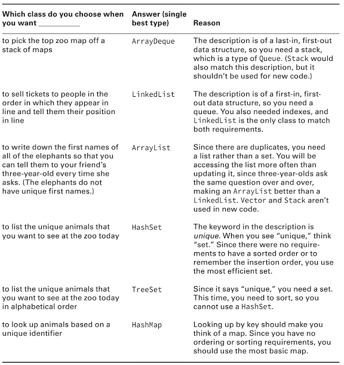
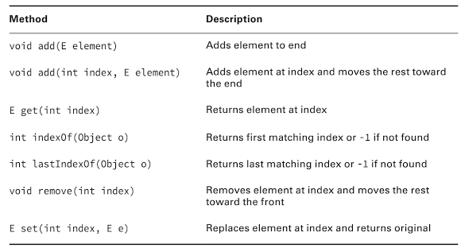
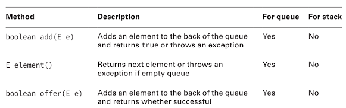
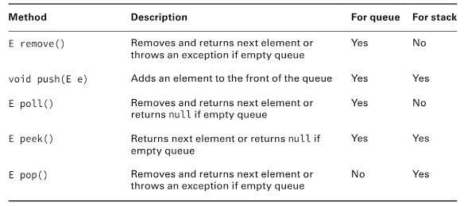
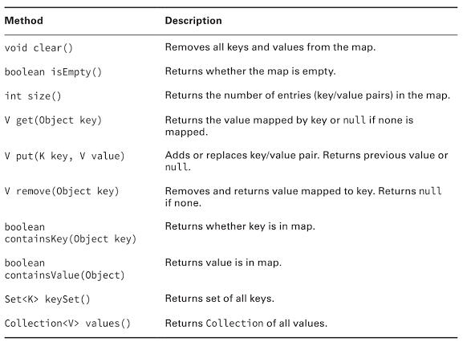
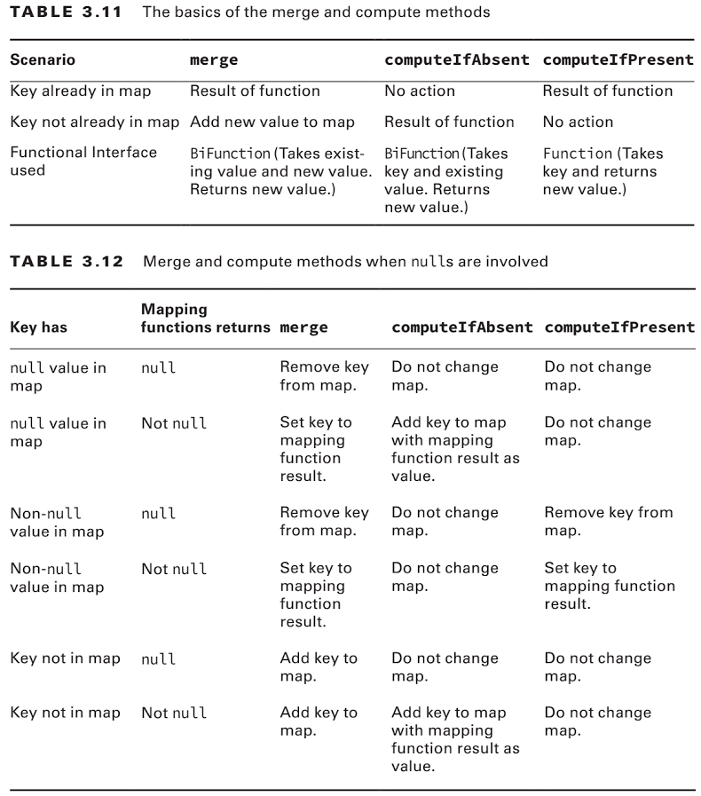

# OCP Java 8
## Collections
| method                            | behavior                                         | return                     |
|-----------------------------------|--------------------------------------------------|----------------------------|
| `boolean add(E element)`          | Inserts a new Element to the Collection          | returns true if successful |
| `boolean remove(Object object)`   | Removes an Element from the Collection           | returns true if match was removed |
| `boolean isEmpty()`               | Checks the size of the Collection if it is Empty | returns true if the Collection is empty |
| `int size()`                      | Looks on how many Entries ar in the Collection   | returns the number of entries |
| `void clear()`                    | Discard all elements in the Collection           | - |
| `boolean contains(Object object)` | Check if a  certain value is in the Collection   | returns true if value is in the Collection |

A quick overview over the diferent Collection Types


A quick overview over the different Collection attributes


Which one doesn't allows null:
  * TreeMap -> no null keys
  * TreeSet -> no null elements
  * ArrayDeque -> no null elements
  * Hashtable -> realy old do not use it
  
When do i use what?



### List Interface methods

#### New in Java 8
There has been a fiew new functions in java 8. 
* ```boolean removeIf(Predicate<?super E> filter)``` to remove from the List
* ```void replaceAll(UnaryOperator<E> o)``` to replace all Elements by the lambda function.
* ```void forEach(Consumer<E> o)``` to iterate over the List.


### Queue Interface methods



### Map Interface methods

#### New in Java 8
There are some new functions comming with Java 8
* ```V put(K key, V value)``` will replace existing keys or add it to the map
* ```V putIfAbsent(K key, V value)``` will add entry the map put wont overrite it unless the value in the map is null
* ```V merge(K key, V value, BiFunction<? super V, ? super V, ? extends V> remappingFunction) ``` will add ether existing value to the map or the new one passed by these function based on the BiFunction mapping algorythm.
* ```V computeIfPresen(K key, BiFunction <? super K, ? super V, ? extends V> remappingFunction) ``` If the the value for the Key is present and non-null, attempts to compute a new mapping given the key and its current mapped value.
* ```V computeIfAbsent(K key, Function<? super K, ? extends V> mappingFunction) ``` If the specified key is not already associeted with a value (or is mapped to null), attempts to compute its value using the given function. If it returns null it will not get stored.



##### BiFunction & Function
```Java
public interface BiFunction<T,U,R> {
	public R apply (T t, U u);
}

public interface Function<T, R> {
	public R apply(T t);
}
```

## Comparable
Comparable is an Interface. It is there so you implement the method to compare to objects with each other. The Interface looks like this
```Java
public interface Comparable<T> {
	public int compareTo(T o);
}
```

What should I return?
  *  0  = Object is equal to argument Object T
  * <0  = Object is smaller than argument Object T
  * \>0 = Object is larger than argument Object T
  
## Comparator
What can i do if i need to sort a class in different ways?
Just use Comparator :)
The Comparator is an Interface. It is there so you can implement a sorting solution based on two arguments. The Interface looks like this:
```Java
public interface Comparator<T> {
	public int compare(T o1, T o2)
}
```

Now you can create a Class or just use Lambdas (Functional Programming)


What is the Difference between those two?

| Difference | Comparable | Comparator |
|------------|------------|------------|
| Package name | java.lang | java.util |
| Interface must be implemented by class comparing? | Yes, silly | No |
| Method name in interface | compareTo | compare |
| Number of parameters | 1 | 2 |
| Common to declare using a lambda | No | Yes |


## Sorting
Just call the static method sort from Collection.sort()
This sort takes ether one argument or two. The first one is the Collection you want to get sorted. The second one is a Comparator. The second one is optional as long as the Class stored in the Collection implements Comparable.

Important: A Tree\* can only store Classes that implements Comparable -> cause it needs to sort things


